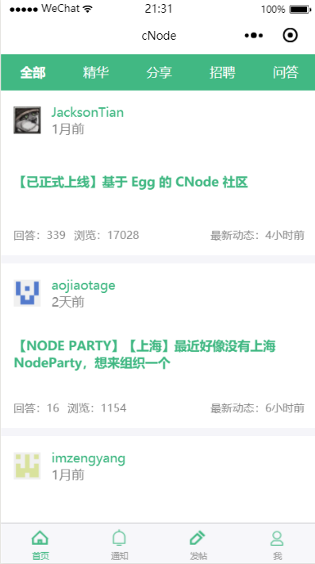
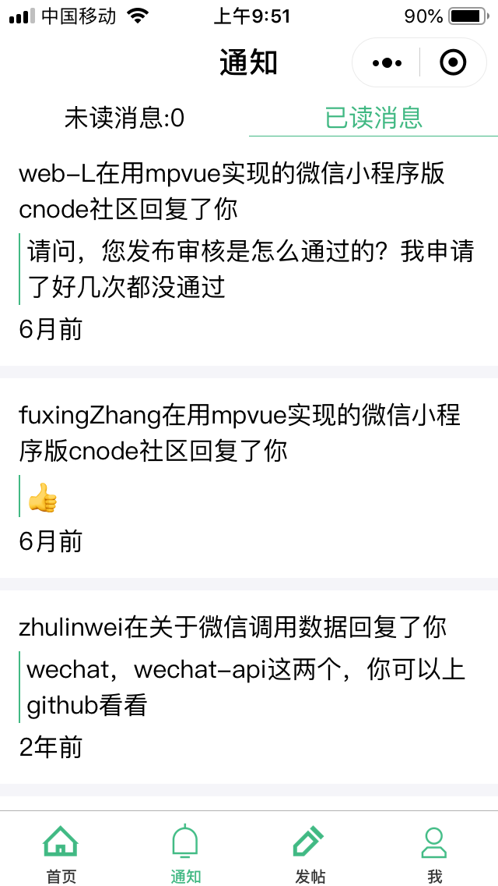
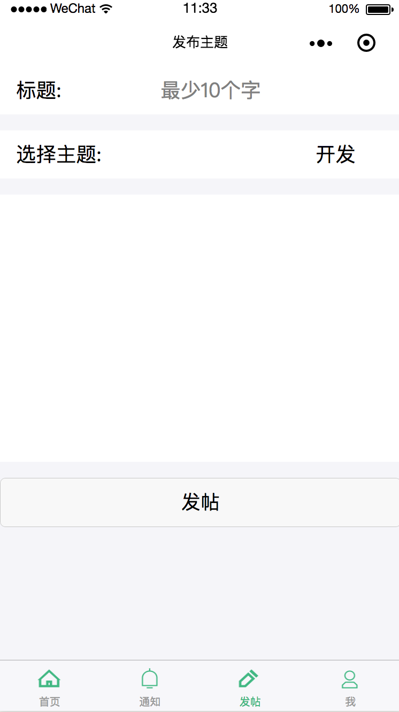
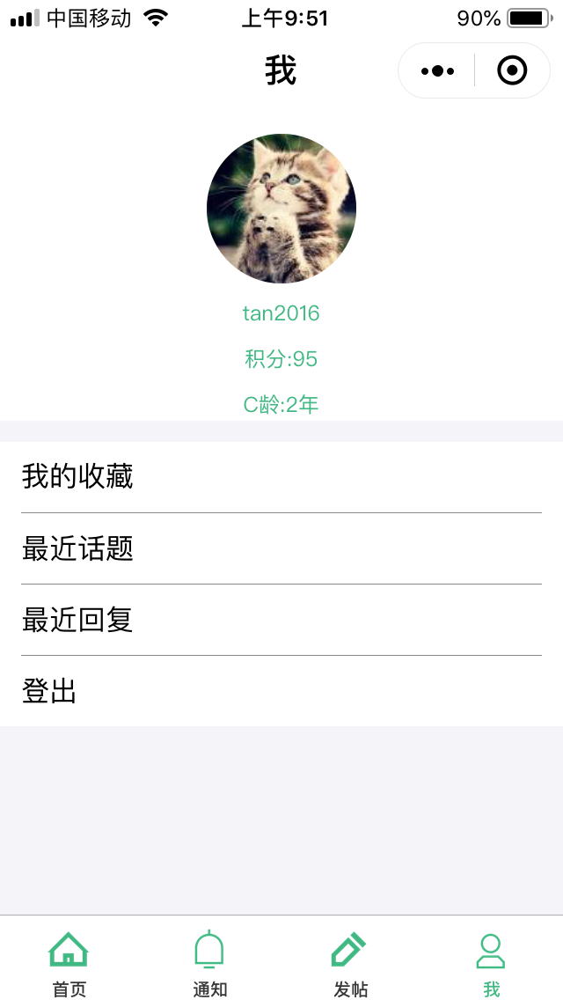

# mpvue-cnode

> 使用mp-vue开发的微信小程序版的cnode。

API来自于[cnode社区](https://cnodejs.org/api)

想熟悉下vue的开发流程，又想体验下mpvue，于是写了个练手项目

## 预览流程

``` bash
npm install

npm run dev

//使用微信开发者工具打开dist目录，关闭域名和https检查即可
```


目录结构
- src
  - pages
    - index 主页
    - detail 帖子详情页
    - me 我的主页
    - publish 发帖页
    - notice 通知页
    - login 登录页
    - user 用户主页
    - list 帖子列表展示页
  - components
    - card 单一帖子头组件
    - authorHead 作者信息头
    - login 登录组件
    - sendreply 回复、评论组建
  - const.js 常量
  - utils 一些工具函数
- static 静态图片部分
目前已经完成了绝大部分功能，尚未完成的功能在和遇到的问题在todo中

目前存在的问题
～～小程序无法动态插入dom，markdwon的解析有点问题， [wemark](https://github.com/TooBug/wemark)在mpvue上使用需要改造下。已封装[mpvue-wemark](https://github.com/673800357/mpvue-wemark)解决


todo

  - 帖子评论、回复功能
  - 帖子收藏和取消收藏功能
  - 评论点赞和收藏的UI同步
  - 帖子详情页加载评论时惰性渲染和回到顶部
  - 编辑自己发过的主题
  - 展示未读消息数和消息已读
  - 部分页面添加下拉刷新
  - 主页几个tab切换有点bug
后话：

这个项目没有涉及到太多复杂的部分，主要到是业务逻辑的开发，对于作为一个vue和mpvue小程序入门项目是非常合适的。由于开发时间短，部分代码质量和交互做得不太好。对于未完成的部分和部分未知bug欢迎各位star、提issue、提pr一起来玩2333.

效果图














- License

MIT
