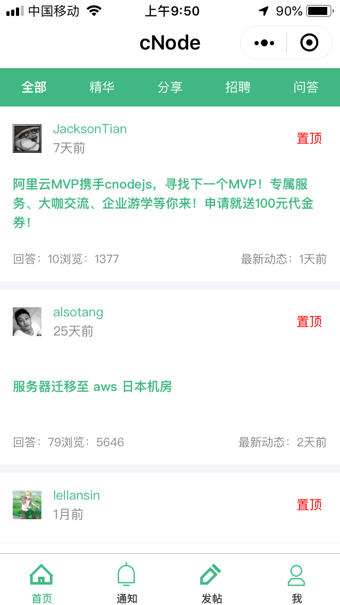

# mpvue-cnode

> 使用mp-vue开发的微信小程序版的cnode。

API来自于[cnode社区](https://cnodejs.org/api)

线上demo


## 预览流程

``` bash
npm install

npm run dev

//使用微信开发者工具打开，关闭域名和https检查即可
```


目录结构
- src
  - pages
    - index 主页
    - detail 帖子详情页
    - me 我的主页
    - publish 发帖页
    - notice 通知页
    - login 登录页
    - user 用户主页
    - list 帖子列表展示页
  - components
    - card 单一帖子头组件
    - authorHead 作者信息头
    - login 登录组件
    - sendreply 回复、评论组件
  - const.js 常量
  - utils 一些工具函数
- static 静态图片部分

部分效果图




- License

MIT
